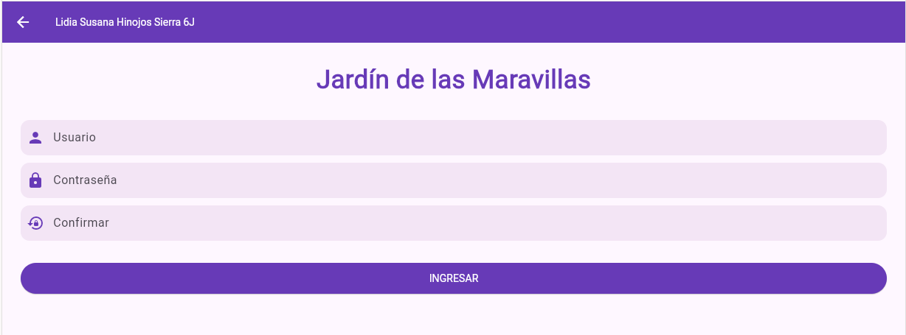
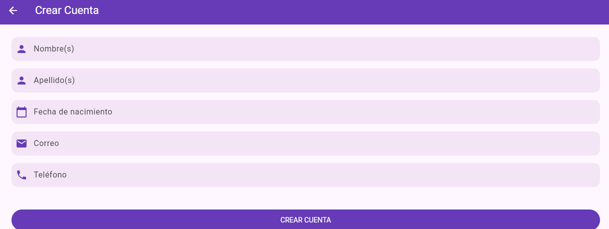
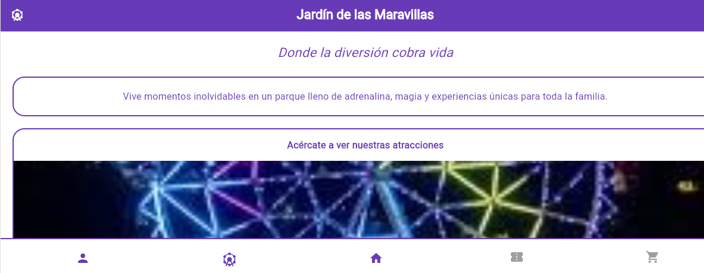
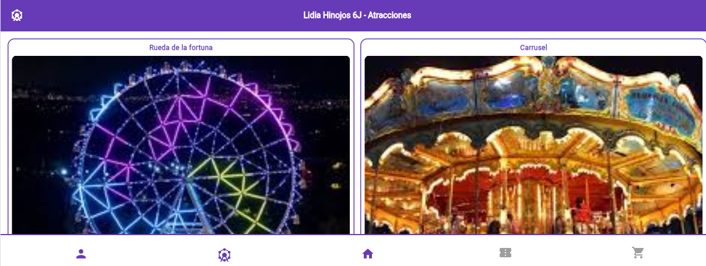

## Navegacion entre paginas con Flutter
## Lidia Hinojos Gpo 6J

## PROMPT
okay gemini, ya tenemos eso, pero ahora haremos otras 3 paginas, haremos una de carga antes de todas las otras, sera solo una pantalla en blanco que diga "Jardin de las maravillas" en morado, debajo estara mi nombre "Lidia Hinojos 6J" y debajo un boton morado que diga "Entrar", cuando se le de clic a ese boton, nos llevara a la siguiente pantalla, que es igual, fondo blanco "Jardin de las maravllas" en morado, mi nombre debajo, pero lo que cambiara sera, que ahora seran dos botones: Iniciar sesion y crear cuenta y debajo de ellos el logo de la rueda de la fortuna en grande, cuando se le de clic a iniciar sesion, me llevara a la pagina uno que ya teniamos hecha, la de inicio de sesion, pero si se le da clic a crear cuenta, nos llevara a una nueva pagina que me haras: sera igual a la de iniciar sesion, pero con estos datos: Nombre(s) Apellido(s) Fecha de nacimiento, correo y telefono y tendra el boton de crear cuenta, despues de crear cuenta quedara exactamente igual el inicio, pero ahora cambiara, que si se le da clic al icono de usuario, nos llevara a la pagina de  iniciar sesion o crear cuenta, usa las paginas que ya teniamos, esas estan bien, solo agrega las uqe te dije, asegurate de que todo tenga sentido y este conectado, todo en tonos morados, porfavor

## WEB

## ANDROID

